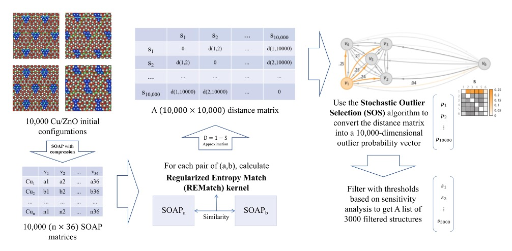

# REMatch-SOS

Machine Learning Accelerated Structure Prediction for Supported Metal Nanoclusters
10.1103/PhysRevMaterials.9.033801

## About REMatch/SOS

**REMatch + SOS** is an **unsupervised, structure-first screening** method for large pools of candidate atomic structures.
Instead of learning energies/forces from labels, it **measures structural similarity** and selects a **diverse, informative subset**
for expensive downstream calculations (e.g., geometry relaxations, DFT, dataset curation).

### What it does
Given a large set of initial configurations, REMatch/SOS:
- encodes each structure with **SOAP** descriptors (optionally compressed),
- computes pairwise structural similarity via the **REMatch kernel**,
- converts similarity to distances and assigns each structure an **outlier probability** using **Stochastic Outlier Selection (SOS)**,
- retains **boundary structures** (neither dense-cluster centers nor extreme outliers) as a representative subset.

In our published testbed, this reduces **10,000 initial configurations per case to ~30% (~3,000)** for full relaxation while
retaining the key low-energy landscape.

### How it differs from supervised ML potentials
Supervised interatomic potentials (e.g., **MACE**) are trained to predict **energies/forces** from labeled data, making them ideal
for:
- quickly removing **unphysical / extremely high-energy** structures,
- fast ranking, MD, or local relaxation.

**REMatch/SOS is complementary**: it does **not** require E/F labels and does not attempt to predict energies.
Its goal is **redundancy reduction and coverage**: after you remove pathological structures (with MACE or any fast surrogate),
REMatch/SOS helps you keep structures that are **structurally distinct** so you spend compute on **new information**, not repeats.

### Typical use cases
- Pre-screening before expensive relaxations (DFT / high-level methods)
- Building diverse training sets for ML potentials / active learning
- Removing near-duplicates from large structure pools (MC/GA/random searches)

## Assumptions & scope

REMatch/SOS is **unsupervised** and **structure-first**: it removes redundancy by measuring *structural similarity*
(descriptor + kernel), not by learning energies/forces.

### Energy-landscape assumptions (paper-motivated)
This workflow is motivated by three common (system-dependent) assumptions about the energy landscape:
1. **Similar initial structures tend to relax to similar local minima.**
2. **Global minima are typically surrounded by structurally (and often energetically) similar local minima.**
3. **As system size increases, the proportion of distinct low-energy structures decreases.**

### Practical requirements
- **Comparable inputs**: structures should represent the same “type of object” (same chemistry / consistent definition).
  If you mix qualitatively different systems, **split into groups** and run selection per group.
- **Descriptor fidelity**: your descriptor (e.g., SOAP) must capture the structural differences you care about.
- **Redundancy exists**: the method is most useful when the pool contains many near-duplicates.
- **Prefilter recommended**: remove unphysical / extremely high-energy structures first (e.g., via MACE or simple heuristics).

### Recommended scope (works best when)
- Large candidate pools from MC/GA/random searches where you want a **diverse subset** before expensive relaxation/DFT.
- Dataset curation / active learning where you want **coverage**, not only “top-ranked by energy”.

### Limitations / when to be careful
- If key physics is not represented in the descriptor/kernel, “diversity” in similarity space may not match what you need.
- Kernel-based similarity can be heavy at scale (pairwise growth); use batching/approximation strategies for large runs.

### ⚠️ Validate before large-scale runs
Before running on very large datasets, do a small pilot (e.g., 500–2000 structures) to calibrate:
- descriptor/kernel settings (do neighborhoods look sensible?),
- SOS threshold range vs. subset size,
- (if energies are available) whether the selected subset preserves low-energy regions and the overall distribution.

## Method overview

REMatch/SOS is a **two-stage screening layer** designed to sit *after* a fast energy sanity-check (optional but recommended).

### Workflow at a glance

1) **(Recommended) Prefilter by energy / validity**
- Use **MACE** (or any fast surrogate / simple rules) to remove *unphysical* or *extremely high-energy* structures.
- Output: a “clean pool” of plausible candidates.

2) **Represent structures (descriptor)**
- Compute a per-structure representation (default: **SOAP**).
- This is the only “view” the method has of your data, so descriptor choice matters.

3) **Measure similarity (kernel)**
- Compute pairwise structural similarities using the **REMatch kernel** (or other kernels).
- Output: a similarity matrix `K` (or a distance matrix `D` derived from `K`).

4) **Score & select (SOS)**
- Run **Stochastic Outlier Selection (SOS)** on the distance space to assign each structure an **outlier probability**.
- Keep **informative boundary structures** (neither dense duplicates nor extreme outliers) to form a representative subset.

### Why “boundary” structures?
Intuitively, you want to:
- **discard dense duplicates** (very similar to many neighbors → redundant),
- **avoid extreme outliers** (often pathological / irrelevant unless you explicitly want them),
- **keep the boundary** where structures are diverse but still representative of the plausible landscape.

In practice, this is controlled by a **threshold / percentile window** on the SOS outlier probability.

### What you get
- `selected_indices` (and optionally `selected.xyz`)
- per-structure diagnostics (e.g., SOS outlier probabilities), which make the selection **auditable and explainable**

### Computational note
Kernel similarity is pairwise and scales quickly with dataset size.
For large pools, use batching / approximation strategies (see the later *Scaling tips* section).

## Methodology: SOAP (structure representation)

**SOAP (Smooth Overlap of Atomic Positions)** is a local-atomic-environment descriptor: it converts each structure (or selected atomic centers)
into numerical vectors so we can measure *structural similarity* consistently across a large dataset.

In this repo, SOAP is used as the **structure-first representation** before computing REMatch similarities and running SOS selection.

### SOAP utilities in this repo

We provide a small, intentionally simple script with two functions:

- `parse_gin_to_atoms(gin_path)`  
  Parse a `*.gin` file into an `ase.Atoms` object.

- `generate_soap_descriptor(atoms, csv_file)`  
  Compute SOAP descriptors on **target centers** using DScribe, then save to `csv_file`.

## Methodology: REMatch kernel (structure–structure similarity)

**REMatch** is a global-structure kernel that compares two structures by *optimally matching their local environments* (here: SOAP vectors) and returning a single similarity score.

### Full kernel computation (`rematch_full.py`)

This repo provides `rematch_full.py`, a **non-approximate** implementation that computes the **full** REMatch similarity matrix `K (N×N)` and converts it to a distance-like matrix `D` for downstream SOS.

What it does (end-to-end):
1. **Load SOAP** from `A{i}.csv` in a directory (each file = one structure; rows = centers, cols = SOAP features).
2. **Normalize SOAP** vectors (row-wise) to make the RBF metric better behaved.
3. Estimate an RBF scale `gamma` from the variance of all stacked SOAP features:
   - `gamma = 1 / (n_features * variance)`
4. Compute the full REMatch similarity matrix:
   - `K_ij = REMatch(struct_i, struct_j)`
5. Convert similarity to distance for SOS:
   - `D = clip(1 - K, 0, +inf)` with `D_ii = 0`
6. Save `D` as a NumPy file (e.g., `distance_full.npy`).

Key functions (readable “3-function” layout):
- `load_soap(directory)`  
  Loads and normalizes `A{i}.csv`, returns `(features_list, indices, gamma)`.
- `get_distance_matrix(K)`  
  Converts `K` → `D` via `D = 1 - K`.
- `process_rematch(soap_dir, output_path)`  
  Runs the full pipeline and saves `distance_full.npy`.

